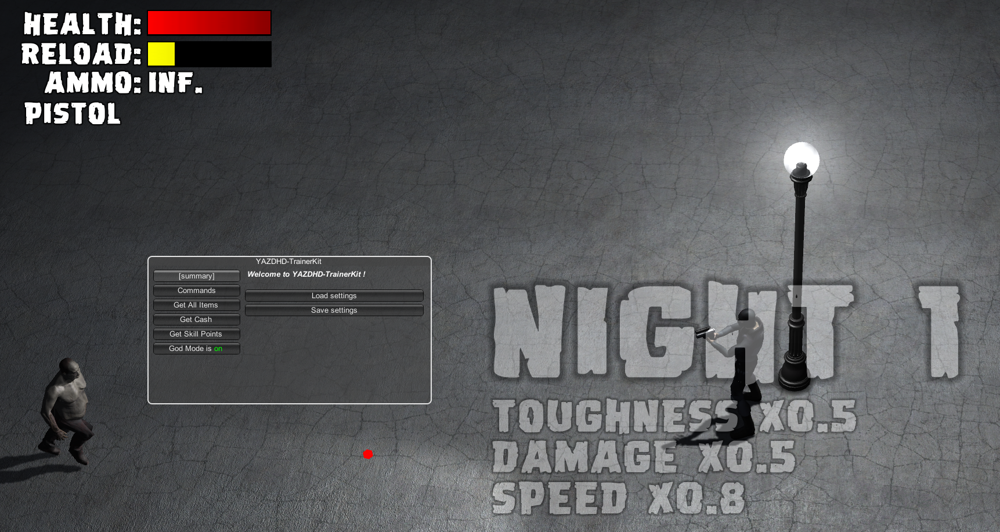

# Yet Another Zombie Defense HD-Trainer

A very simple trainer for the excellent [Yet Another Zombie Defense HD](https://store.steampowered.com/app/674750/Yet_Another_Zombie_Defense_HD) game. 

This trainer was built using [TrainerKit](https://github.com/sailro/TrainerKit).

How to use the trainer:
- Start the game 
- Run `TrainerKit.exe` to inject the trainer into the process (you do not need to copy files in a specific location).
- Use keypad `*` to trigger god mode
- Use keypad `/` to buy all weapons (999999 available+ammo)
- Use keypad `+` to add 999999 skill points (use it when the skill menu appears)
- Use keypad `-` to add 999999 $

You can compile everything or simply use the [binary release](https://github.com/sailro/YAZDHD-Trainer/releases).

Have fun !

